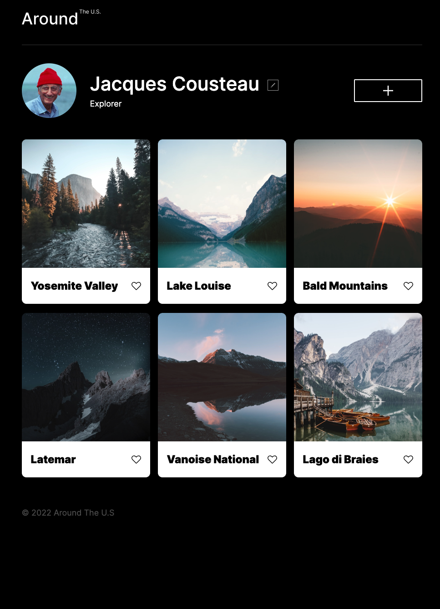

# Project 4: Around The U.S.

This project dives deep into adaptive or responsive design along with making the design more interactive.
By using media queries and javascript the design is meant to adjust and fit its contents whether the screen is being view from a mobile phone or desktop.

https://Abecoder24.github.io/se_project_aroundtheus

- Intro
- Figma
- Images

**Intro**

This project is made so all the elements are displayed correctly on popular screen sizes. We recommend investing more time in completing this project, since it's more difficult than previous ones.

**Figma**

- [Link to the project on Figma]https://www.figma.com/file/mUgu8OSHWE0M6p6vfwmdu9/Sprint-4%3A-Around-The-U.S.-%2F-desktop-%2B-mobile?node-id=6432%3A74&t=ubqPca6yHiIwmXBM-0

**Images**

The way you'll do this at work is by exporting images directly from Figma — we recommend doing that to practice more. Don't forget to optimize them [here](https://tinypng.com/), so your project loads faster.

Good luck and have fun!

test
